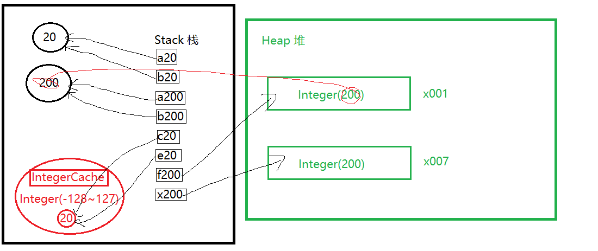

# 虐杀面试者的 Java 基本类型和 IntegerCache

## 1. Stack 栈

- Stack in java is a section of memory which contains methods, local variables, and reference variables. Stack memory is always referenced in Last-In-First-Out order. Local variables are created in the stack.
  - java 中存储 方法 局部变量 和 引用变量的地方， 遵循 后进先出/先进后出 原则。
- StackOverflowError

```java
void testStackOverflow(){
    testStackOverflow(); // Exception in thread "main" java.lang.StackOverflowError
}
```

## 2. Heap 堆

- Heap is a section of memory which contains Objects and may also contain reference variables. Instance variables are created in the heap
  - 堆是存放对象的地方。
- OutOfMemoryError

```java
final List<TestInt> testIntList = new ArrayList<>();
while (true) {
    testIntList.add(new TestInt()); // Exception in thread "main" java.lang.OutOfMemoryError: Java heap space
}
```

## 3. Java 基本类型

- 8 primary types. ( 1 Byte = 8 bits )

|         #         | 字节 Byte (位 bit) |        备注         |        MIN_VALUE         |        MAX_VALUE        |
| :---------------: | :----------------: | :-----------------: | :----------------------: | :---------------------: |
| boolean (Boolean) |       1 (8)        | 逻辑变量 true false |                          |                         |
| char (Character)  |       2 (16)       |   单个字符(常用)    |         '\u0000'         |        '\uffff'         |
|    byte (Byte)    |       1 (8)        |   字节数据(常用)    |           -128           |           127           |
|   short (Short)   |       2 (16)       |   兼容性考虑不用    |          -32768          |          32767          |
|   int (Integer)   |       4 (32)       |  普通整数(特常用)   |       -2147483648        |       2147483647        |
|    long (Long)    |       8 (64)       |    长整数(常用)     |  -9223372036854775808L   |  9223372036854775807L   |
|   float (Float)   |       4 (32)       |    浮点数-不常用    |         1.4E-45F         |      3.4028235E38F      |
|  double (Double)  |       8 (64)       |    双精度浮点数     | 2.2250738585072014E-308D | 1.7976931348623157E308D |

- 自动转换 byte -> short -> int (char) -> long -> float -> double

- 强制转换 会丢失精度或出错

```java
short s3 = 3;
s3++;
System.out.println(s3);
s3 = s3 + 1; // compile error: required short but provided int
```

```java
byte b10 = 10;
byte b20 = 20;
// byte b30 = b10 + b20; // compile error
byte b30 = (byte) (b10 + b20);
```

## 4. == 和 equals 以及 IntegerCache

- == 比较的是两个变量的地址, equals 则根据实现不同
- IntegerCache -128 ~ 127

```java
final int a20 = 20;
final int b20 = 20;
System.out.println(a20 == b20);     // true

final int a200 = 200;
final int b200 = 200;
System.out.println(a200 == b200);   // true

final Integer c20 = 20;
final Integer e20 = 20;
System.out.println(c20 == e20);         // true
System.out.println(c20.equals(e20));     // true

final Integer f200 = 200;
final Integer x200 = 200;
System.out.println(f200 == x200);        // false
System.out.println(f200.equals(x200));     // true

System.out.println(f200 == a200);     // true
System.out.println(x200 == a200);     // true
System.out.println(f200 == x200);     // false

System.out.println(c20 == a20);     // true
```

- a20,b20,a200,b200 是基本类型，都是栈中的变量，指向相同的值
- c20,e20 是引用类型，但是会指向 IntegerCache 中相同的对象 Integer(20)
- f200,x200 是引用类型，超过了 IntegerCache 的范围，所以
- 如果一个引用变量和一个基本类型比较，那么比较的是他们的值
  

## 5. Kotlin ?

这里呢留个悬念，下期再分析 Kotlin 对象怎么比较，== 和 === 的区别

```kotlin
val c20 = 20
val e20 = 20
println(c20 == e20)     // true
println(c20 === e20)    // true

val f200 = 200
val x200 = 200
println(f200 == x200)   // true
println(f200 === x200)  // true
```
